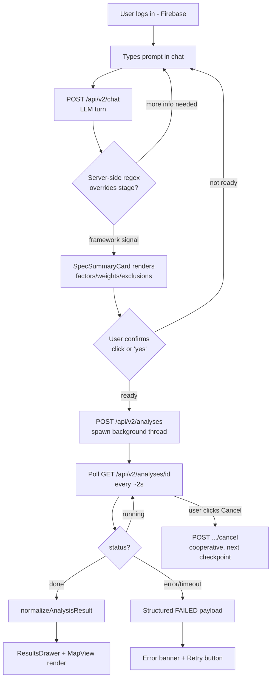
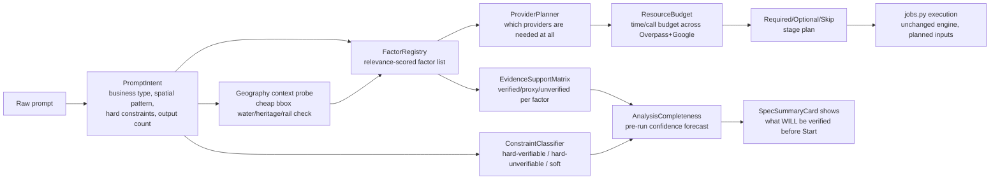

# STRATAGEO Portal Latest Project Audit

**Scope:** honest architectural audit of the deployed system as of `master @ 3e601a6` (v1.4.8, live in production). No source changes were made to produce this document. All file/line references are to the current repo state.

---

## 1. Executive Summary

StrataGeo is a conversational site-suitability engine: a user describes a business ("quick-service cafe near Ruby Crossing"), an LLM turns that into a structured spec (factors, weights, catchments, hard constraints), and a Python backend runs a two-pass H3-hex MCDA (multi-criteria decision analysis) over OSM + Google Places + ORS/Google Routes data to rank candidate micro-market zones.

**Latest deployed version:** `appVersion 1.4.8`, `releaseName "Result Contract Stability & Google Provider Intelligence"`, backend on Cloud Run (`stratageo-engine`, `asia-south1`), frontend on GitHub Pages.

**What changed in the latest deployment (v1.4.7 → v1.4.8, folded into one bump):**
- v1.4.7 fixed a production crash where *any* degraded provider run (the common case) threw `TypeError: unsupported operand type(s) for +: 'int' and 'list'` inside evidence assembly (`evidence_builder.py`, summing a mixed-type diagnostics dict). A numeric-scoring contract (`engine/contracts.py`) and a three-state result payload (`success` / `no_viable_site` / `failed`) were added.
- v1.4.8 added a typed Google provider layer (`app/providers/`) — Places API (New), Places Aggregate, Routes, Place Details — with legacy Places/OSM/ORS retained as fallback, plus retry/backoff/circuit-breaker/budget policy.

**Current main issue — the framework is not smart or resource-aware.** The pipeline in `jobs.py` is a long, *mostly unconditional* sequence of stages. The single biggest structural problem: `_buildability_flags()` (`jobs.py:81-101`) gates 4-6 sequential Overpass calls (railway, ghat, heritage/protected, maidan, road-frontage) behind a regex (`_COMMERCIAL_RE`) that matches "restaurant|cafe|café|coffee|qsr|...|retail|shop|store|...|supermarket|grocery|bakery|clinic|salon|gym|bank|pharmacy" — i.e. it fires for **almost every business type the portal supports**, not just waterfront or genuinely risky sites. A cafe prompt with zero water/heritage/railway risk still pays for the same buildability stage as a riverside restaurant. There is no per-prompt relevance gate; every analysis runs the same generic checklist and only the *values found* differ, not the *work done*.

**Why analysis confidence is being hurt:** the system conflates three different things that should be kept separate — (1) verified spatial facts (water mask, railway buffer — real OSM geometry), (2) statistical proxies presented with unlabeled confidence weight (student catchment = school/college POI count, affluence = luxury POI density), and (3) genuinely unsupported constraints (rent, parcel size, legal buildability) that are detected and flagged as "unverifiable" but the user still sees a ranked list with scores computed *as if* every factor were equally trustworthy. A 0.32-weighted "student catchment proxy" (schools/colleges as a stand-in for footfall) and a 0.18-weighted "direct cafe competition" (real Google Places count) are blended into one `mcda_score` with no confidence-weighted discounting — the number looks precise (`7.1/10`) but the underlying evidence quality varies by an order of magnitude between factors.

---

## 2. Current User Flow

1. **Login** — Firebase auth (Google or email), gates access to a metered prompt quota (`X of 10 queries left`, visible in `TopBar`/`FloatingAssistant`).
2. **Prompt input** — free text into `FloatingAssistant`'s chat box (`src/components/FloatingAssistant.tsx`).
3. **LLM/spec generation** — `POST /api/v2/chat` (`chatService.ts:sendChatTurn`) → `routers/chat.py` → `services/llm.py:chat_turn()`. One `gpt-4o`-class call per turn; server-side regex classifiers (`RUN_SIGNAL`, `FRAMEWORK_SIGNAL`, `AFFIRMATION`, `NO_GO` in `llm.py:62-79`) override the model's own `stage`/`readyToExecute` flags because they're "inconsistent across turns" (comment, `llm.py:58-60`) — a tacit admission the LLM's structured-output discipline isn't trusted.
4. **Spec/framework card** — `SpecSummaryCard.tsx` renders factors, weights, catchments, hard exclusions, weak-proxy warnings, feasibility banner.
5. **Start Analysis** — a sticky action bar (`FloatingAssistant.tsx`, `.assistant-action-bar`) appears once `analysisPhase === 'spec_ready'`; clicking it or typing a confirmation phrase (`analysisFlow.ts:isConfirmationPhrase`) calls `handleConfirmExecute` in `App.tsx`.
6. **Backend job creation** — `POST /api/v2/analyses` (`chatService.ts:startAnalysis` → `routers/analyses.py:start_analysis`) validates the spec against `SpecV2` and spawns a background thread (`jobs.py:start_job` → `threading.Thread(_run_in_thread)`).
7. **Progress polling** — `GET /api/v2/analyses/{id}` every ~2s (`chatService.ts:pollAnalysis`), with a client-side stall watchdog (220s) and a hard 6-minute client deadline, mirroring the backend's own 240s job ceiling (`config.py:job_max_runtime_seconds`).
8. **Result rendering** — `normalizeAnalysisResult()` (`resultNormalizer.ts`) repairs/validates the payload before anything touches React state; `ResultsDrawer.tsx` renders scores, evidence, provisional/degraded banners; `MapView.tsx` renders hex-grid heatmap + candidate pins + catchment outlines.
9. **Retry/cancel** — `Cancel` calls `POST /api/v2/analyses/{id}/cancel` (cooperative — takes effect at the next `_update()` checkpoint, which can be up to one Overpass call's worst-case latency later); `Retry` resubmits the last spec unchanged.

---

## 3. Current Backend Analysis Pipeline

Order as executed in `services/jobs.py:_run_analysis()` (uploaded-candidates-only mode is a separate short-circuit branch, omitted here for clarity — see `jobs.py:459-592`).

| Stage | File/function | Required? | Provider | Output | Current failure behavior | Should block? |
|---|---|---|---|---|---|---|
| Study area resolve | `study_area.py:resolve_study_area` | **Required** | Google Geocode → Nominatim | shapely polygon | No fallback beyond Nominatim; unhandled exception → job `error` | Yes |
| Metro station resolve | `metro.py:resolve_metro_stations` | Conditional (only if metro exclusion detected) | static verified list + OSM fallback | station list + confidence | Silent — used to override exclusion POIs later | No (advisory) |
| H3 grid build | `grid.py:polyfill` | **Required** | none (local) | list of hex cells | Auto-degrades resolution if hex count explodes; raises if 0 hexes | Yes |
| Combined OSM fetch | `data_osm.py:fetch_all_layers` | **Required** (one union query for every layer+exclusion) | Overpass (3-mirror failover) | `{layer_id: [pois]}` | Degrades to "layers scored as zero" note; 120s timeout | No — degrades |
| Per-layer Places fetch | `providers/google_places_new.py:fetch_pois_with_fallback` | Optional per google_places layer | Places New → legacy → OSM-only | POI list + source label | Degrades, falls back down the chain | No — degrades |
| Metro exclusion override | `metro.py:metro_stations_to_pois` | Conditional | verified station list | replaces OSM exclusion POIs | Falls back to "unenforced" note | No |
| **Pass A scoring** | `scoring.py:pass_a` | **Required** | none (BallTree over fetched POIs) | composite 0-1 per hex, per-layer `LayerScores` | Missing-data layers excluded from composite (never fabricated 0/10) | Yes (core) |
| Custom/sandbox layers | `sandbox.py:run_custom_layer` | Optional, feature-flagged off by default | none | overrides Pass-A raw values | Skipped with a note if disabled | No |
| Exclusion mask (buffer) | `scoring.py:exclusion_mask` | Conditional (only if `spec.exclusions`) | OSM (already fetched) | boolean mask | n/a — pure local computation | n/a |
| Water body geometry | `data_osm.py:fetch_area_geometries` | Optional (shared by corridor + water mask) | Overpass | polygon list | Degrades to "water geometry unavailable"; **for waterfront briefs this then WITHHOLDS the ranking** (correct), but the fetch itself always runs whenever any `spec.corridors` or waterfront exists | For waterfront: yes (indirectly, via corridor-failed flag) |
| Corridor gates | `corridors.py:distance_to_lines_m` | Conditional (`spec.corridors` present) | OSM line/area geometry | boolean mask | Un-enforced gate is reported, not silently dropped | Yes for waterfront strict corridors |
| Water mask | `water.py:water_mask` / `water_overlap_mask` | Runs whenever water geometry was fetched | OSM | boolean mask | n/a | Yes when water geometry exists |
| **Buildability masks** | `buildability.py` via `jobs.py:986-1138` | **Conditional but over-broad** — fires for waterfront OR any `_COMMERCIAL_RE` match (§8) | Overpass (up to 5 sequential calls: railway area, railway lines, ghat, protected area, maidan) | boolean masks + `mask_stats` counts | Each sub-check individually degrades (30s timeout each); never hard-fails | No — soft, but **runs unconditionally for ~90% of prompts regardless of actual risk** |
| Candidate selection | `scoring.py:select_candidates` | **Required** | none (local) | top-K hex indices | Empty → early `no_viable_site` return | Yes |
| Isochrone refinement (Pass B) | `catchments.py:fetch_isochrones` | Optional, per walk/drive layer | ORS | per-candidate refined counts | Degrades to Euclidean proxy, noted | No — degrades |
| **Places Aggregate refinement** | `providers/google_places_aggregate.py:compute_count` | Optional, top-8 candidates × google layers | Places Aggregate (Area Insights) | refined float count | Self-disables on 403/404; degrades on timeout/5xx | No — degrades |
| Traffic-aware catchment | `traffic.py:traffic_catchment` | Optional, only `trafficAware` drive layers | Google Routes matrix | reachable-count + congestion | Circuit-opens after 3 failures | No — degrades |
| Route constraints | `routing.py:evaluate_route_constraint` | Conditional (`spec.routeConstraints`) | Google Routes → ORS fallback | pass/fail + metrics per candidate | Unavailable → candidate excluded (required routes) | Yes if `required=True` |
| Strict-route enforcement gate | `route_policy.py:validate_strict_route_constraints` | Conditional (LLM missed encoding a detected strict phrase) | none (local check) | withhold flag | Withholds rather than silently Euclidean-passing | Yes |
| Deterministic geographic critic | `jobs.py:1747-1806` | Runs for final candidates when `bflags.commercial_proxy` | none (local, uses fetched geometry) | `riverDistanceM`, `buildabilityStatus`, hard corridor gate | Hard-excludes waterfront candidates outside the band | Yes for waterfront |
| Place Details enrichment | `providers/google_place_enrichment.py:enrich_top_pois` | Optional, capped ≤6 places | Place Details (New) | evidence-only fields | Silently skipped on disabled/degraded | No |
| Explanations | `results.py:write_explanations` | Optional (LLM summary text) | OpenAI | summary + per-candidate reasoning | try/except → generic fallback string | No |
| LLM critique | `services/critic.py:critique_analysis` | Optional (cost-mode gated; **currently `criticEnabled: false`** in prod per `/health`) | OpenAI | critique dict or `None` | Fail-soft, ships without it | No |
| Deterministic critic | `reliability_critic.py:run_deterministic_critic` | **Required** (always-on, no LLM) | none (local) | verdict `reliable/weak/unreliable` | Drives `analysis_status` | Yes (informs status, doesn't itself throw) |
| Multi-score / evidence trail | `multi_score.py`, `evidence_builder.py` | **Required** for the result payload | none | `factorScores`, `evidenceTrail` | Was the v1.4.7 crash site; now contract-validated | Yes (must succeed for a usable payload) |

**Observation:** of ~20 distinct stages, only 5-6 are genuinely gated by prompt relevance (water mask, corridor, route constraints, traffic-aware catchment). The rest either always run or run behind an over-broad trigger (buildability). There is no single "is this stage worth its cost for this prompt?" decision point anywhere in the pipeline.

---

## 4. Current Framework / Spec Logic

**How a prompt becomes factors:** two competing mechanisms coexist.
1. `intent_parser.py:parse_raw_intent()` — deterministic regex-based extraction (business type key, hard-constraint phrases, strict-route/strict-walk flags, student-demand signal, topN).
2. `canonical_archetypes.py` — a **frozen registry** of 11 archetypes (`student_qsr_cafe`, `premium_restaurant`, `dark_kitchen`, `large_format_retail`, …), each with hardcoded factor keys/weights/catchments/scoring curves that **the LLM cannot override** (`deterministic_planner.py:apply_deterministic_plan` — "LLM keeps its role for explanation text… LLM role is explicitly set to: explanation_only").

This is actually one of the *better* design decisions in the codebase — it prevents LLM weight-hallucination — but it means the "framework" is really a **lookup table of ~10 pre-baked factor sets**, not a system that reasons from the specific prompt to the specific factors needed. A "quick-service cafe targeting students" and a plain "cafe in Salt Lake" resolve to two different archetypes (`student_qsr_cafe` vs `generic_qsr_cafe`) via one regex (`canonical_archetypes.py:detect_student_qsr`) — there is no `generic` archetype tuning based on anything else in the prompt (target demographic nuance, footfall style, price point) beyond that single split.

**How constraints become hard gates:** `intent_parser.py`'s regexes (`_STRICT_ROUTE_RE`, `_STRICT_WALK_RE`) detect *phrasing* ("exactly within", "strictly within", "delivery drive") and set `hasStrictRouteConstraint`; `route_policy.py` then checks whether the deterministic spec actually encoded a matching `routeConstraint` — if the LLM missed it, the analysis is retroactively marked unenforced. This is a **repair mechanism for LLM unreliability**, not a first-class constraint pipeline; it works, but it means correctness depends on the raw-intent regex covering every real phrasing the LLM might miss.

**How weights are assigned:** entirely from the canonical archetype's frozen `CanonicalFactor.weight` (int, must sum to 100). The LLM can inherit OSM tag/type choices from its own draft layer but **not** weight, direction, or catchment (`deterministic_planner.py:224-233`). Weights are static per archetype — a cafe near a university and a cafe in a random residential pocket get the *identical* 32/27/18/14/9 split.

**How weak proxies are marked:** `CanonicalFactor.proxy_warning` (a free-text string) and `confidence_default` ("high"/"medium"/"low") are attached per-factor at registry-definition time — this is honest and good — but it's a **static label chosen once when the archetype was written**, not a runtime assessment of whether the proxy actually held up for *this* run (e.g. "10 schools found" vs "0 schools found" both carry the same `confidence: "medium"` label).

**How unsupported constraints (rent, parcel size) are handled:** `constraint_policy.py` regex-detects rent/footprint/zoning/parcel/ownership language in the objective+constraints text and marks the whole analysis `provisional` (`constraintEnforcementLevel`), demoting any `RECOMMENDED` to `CANDIDATE_ZONE`. This is correct and one of the stronger parts of the system — but it's a **global** downgrade (the whole analysis becomes provisional) rather than a **per-constraint** label attached to just the rent/footprint line. A user sees "PROVISIONAL — field validation required" without a clean per-item breakdown of *which* number is unverified vs which factor is solid.

**Does the framework skip irrelevant checks, or run a generic checklist?** **It runs a generic checklist.** Beyond the archetype→factor mapping (which is itself a fixed lookup, not reasoning), nothing in the spec or the engine asks "does this prompt need buildability checking?" or "does this prompt need a water mask?" before running them. The trigger for buildability is a keyword regex broad enough to match nearly every business type (§8), and the water/corridor fetch runs whenever `spec.corridors` is non-empty, which the LLM sets somewhat independently of whether water is actually relevant.

---

## 5. Provider/Data Source Inventory

| Provider | Used for | Files | Primary/fallback | Timeout | Retry | Cache | Failure mode | Cost/resource risk |
|---|---|---|---|---|---|---|---|---|
| OSM/Overpass (POI) | all non-Places layers, exclusions, OSM supplement | `data_osm.py:fetch_layer_pois`, `fetch_all_layers` | Primary (only source for infra/land/water/transit) | 25s/endpoint × 3 mirrors (~77s worst case) | 1 attempt/mirror, no backoff (fail over instead) | in-memory (6h TTL) + GCS | Union query fails → per-layer fallback (bounded concurrency 2) | Low $, moderate latency risk (3-mirror worst case) |
| OSM/Overpass (line geometry) | corridors, railway barriers | `data_osm.py:fetch_line_geometries`, `routing.py:fetch_railway_lines` | Primary | 25s × 3 mirrors | same | GCS | raises `RuntimeError`, caught by caller (degraded) | Low $, same latency risk |
| OSM/Overpass (area geometry) | water, buildability polygons | `data_osm.py:fetch_area_geometries` | Primary | 25s × 3 mirrors | same | GCS | raises, caught | Low $ |
| OSM/Overpass (named search) | ghat/maidan name matching | `data_osm.py:fetch_named_features` | Primary | 25s × 3 mirrors | same | GCS | **never raises** — returns `[]` | Low $ |
| Google Places legacy (Nearby Search) | POI fallback when New unavailable | `data_places.py:fetch_places_pois` | Fallback (tier 2) | 30s/request | none | none | try/except per page, partial results kept | Medium $ (billed per request, ≤25 sample pts × 2 pages) |
| Google Places API (New) | POI primary for `google_places` layers | `providers/google_places_new.py` | Primary (tier 1) | 12s + 2s buffer | 2 (429/5xx/network only) | per-job in-memory | 403/404 → self-disables; else falls to legacy | Medium-high $ (per-request billed, New pricing) |
| Google Places Aggregate | count refinement, top-8 candidates | `providers/google_places_aggregate.py` | Refinement-only (no fallback tier — just skipped) | 12s + 2s | 2 | per-job | 403/404 self-disables (common — API often not enabled) | Low-medium $ but **unverified availability** (§17) |
| Google Place Details (New) | evidence enrichment, ≤6/job | `providers/google_place_enrichment.py` | Evidence-only | 12s + 2s | 2 | per-job | stops enriching on disabled/degraded | Low $ (hard-capped) |
| Google Routes (`computeRoutes`) | route-constraint validation, primary | `providers/google_routes.py` | Primary | 15s + 2s | 2 | per-job | falls to ORS | Medium $ |
| Google Routes (`computeRouteMatrix`) | traffic-aware drive catchment | `engine/traffic.py` | Only path (no fallback) | 60s | 3-failure circuit breaker | GCS | circuit opens, degrades to Euclidean proxy value | Medium $ (1 call per candidate × traffic layer) |
| ORS Directions | route-constraint fallback | `engine/routing.py:route` | Fallback (tier 2) | 60s | none | GCS | returns `None` → constraint unavailable | Free tier (rate-limited) |
| ORS Isochrones | Pass-B walk/drive refinement | `engine/catchments.py:fetch_isochrones` | Only path (no Google isochrone equivalent wired) | 60s, batched | none (best-effort) | in-memory + GCS + 20/min limiter | keeps Euclidean proxy | Free tier (~500/day) — **hard external ceiling with no fallback provider** |
| Google Geocode / Nominatim | study-area + route-target geocoding | `study_area.py:geocode` | Google primary, Nominatim fallback | 15s each | none | none | falls to Nominatim, then `None` | Low $ |
| Nominatim reverse geocode | candidate naming | `study_area.py:reverse_geocode_name` | Only path | 15s | none | none | returns `None` → generic "Candidate N" name | Free (rate-limited by Nominatim policy) |
| GCS (job snapshots + caches) | job state, Overpass/isochrone/route cache | `services/storage.py` | n/a | n/a | n/a | is the cache | `storage.enabled()` gate — silently no-ops if unset | Low $ |

---

## 6. Factor Families and Data Support

| Factor | Real data? | Proxy? | Evidence source | Confidence | Should be scored? | Should be caveat only? |
|---|---|---|---|---|---|---|
| Direct competition (cafe/restaurant/retail) | Real (mostly) | Partial — Places count ≠ actual sales cannibalization | Google Places (New/legacy) + OSM supplement | High (per archetype default) | Yes | No |
| Commercial co-tenancy | Real count, weak causal link | Proxy — presence of other shops ≠ complementary footfall | Google Places/OSM | Medium | Yes | Add caveat |
| Pedestrian/transit access | Real count | Weak — station/stop COUNT, not actual passenger volume | OSM (`railway=station`, `public_transport=station`) | Medium | Yes | Add caveat |
| Road access / arterial proximity | Real geometry (distance-to-line) | None — this is a genuine spatial fact | OSM highway tags | High | Yes | No |
| Student catchment proxy | Proxy | Strong proxy — school/college/coaching COUNT, explicitly documented as weak for QSR demand (`canonical_archetypes.py:194-199`) | OSM `amenity=school/college/university` | Medium (self-labeled) | Yes, but should be down-weighted vs. verified factors | Yes — already partially captioned |
| Residential/office delivery demand | Proxy | Strong proxy — building COUNT, not actual household/office density or delivery order volume | OSM `building=residential/apartments` | Medium | Yes | Yes |
| Tourist/leisure footfall | Proxy | Strong proxy — POI count of "attraction"/"park"/"theatre" | Google Places | Medium | Yes | Yes |
| Affluent residential catchment (affluence) | Proxy | Very strong proxy — "luxury POI density as income proxy; actual income data unavailable" (self-documented, `canonical_archetypes.py:329`) | OSM | **Low** (self-labeled) | Debatable — currently scored at 30% weight for premium restaurant | Should be caveat-heavy, weight reduced |
| Buildability (railway/ghat/heritage/open-space) | Real geometry where OSM has it | Absence-of-mask ≠ buildable — explicitly documented ("OSM is incomplete in India… absence of a mask is unknown, not buildable", `buildability.py:10-11`) | OSM | Medium (data-source incompleteness, not modeling uncertainty) | Yes as an exclusion (hard, evidence-gated) | Also needs an explicit "unknown ≠ safe" disclosure per candidate |
| Frontage/barrier penalty | Proxy | Weak — railway/motorway proximity as a stand-in for "dead frontage", no actual foot-traffic-blocking evidence | OSM | Medium | Debatable at 9% weight | Yes |
| Water/rail/open-space/heritage exclusions | Real geometry (hard gate) | None when geometry is found; **unenforced-but-silent risk if not found** (mitigated by v1.4.7's honest "unverifiable" gate for waterfront) | OSM | High when geometry exists | Yes (hard exclusion) | Flag when geometry unavailable |
| Routing/drive-time (Google Routes/ORS) | Real when it succeeds | None — genuine network routing | Google Routes → ORS | High when `status: evaluated` | Yes (hard gate for `required=True`) | "Provisional" when unavailable — already implemented |
| Rent / lease price ceiling | **Unsupported** | n/a — no spatial data source exists for rent | none | n/a | **No — correctly never scored** | Yes, and this already works (`constraint_policy.py`) |
| Parcel / floor-area / footprint requirement | **Unsupported** | n/a | none | n/a | **No — correctly never scored** | Yes, already works |
| Zoning / licensing / FSSAI / permits | **Unsupported** | n/a | none | n/a | No | Yes, already works |
| Competing kitchen density (dark kitchen) | Proxy, admitted sparse ("Dark kitchen OSM/Places coverage very sparse in India", `canonical_archetypes.py:421`) | Strong proxy, low confidence self-labeled | Google Places | **Low** | Debatable at 20% weight given self-admitted sparsity | Yes |

---

## 7. Four Prompt Deep Dive

### 1. "Quick-service cafe targeting students near Ruby Crossing and EM Bypass"
Archetype resolves to `student_qsr_cafe` (regex `detect_student_qsr`). Real ask: rank walkable micro-markets by student footfall proxy + transit access, penalize direct cafe competition. **Wasteful:** `_COMMERCIAL_RE` matches "cafe" → full buildability stage (railway/ghat/heritage/maidan, up to 5 Overpass calls) runs even though there's no waterfront/heritage-district signal in the prompt at all — Ruby Crossing/EM Bypass is a dense urban junction, not a heritage or ghat-adjacent area. This is pure wasted latency and Overpass load for this prompt.

### 2. "Premium riverside restaurant, strictly between Howrah Bridge and Vidyasagar Setu"
Archetype `premium_restaurant`, `waterfront.isWaterfront=true`, strict corridor (≤500m clamp). Real ask: enforce a tight riverfront band, exclude water/ghat/heritage land, rank by affluence + premium co-tenancy − competition. **Here buildability + water mask are fully justified** — this is the one prompt of the four where the generic checklist happens to match the actual need. Water/corridor gates are correctly hard-blocking (`waterfront_corridor_unenforced` → `insufficient_viable_land`, never silently kept-all).

### 3. "10,000 sq ft discount supermarket in Sector V, arterial road, rent ≤ ₹20/sq ft"
Archetype `large_format_retail`. Real ask: arterial-road proximity + residential drive-catchment density, competition check, with rent/footprint explicitly flagged unverifiable (both already correctly caught by `constraint_policy.py`'s `_RENT_RE`/`_FOOTPRINT_RE`). **Wasteful:** "supermarket|grocery" is in `_COMMERCIAL_RE`, so buildability still runs in full — Sector V is a planned commercial district with essentially no railway/ghat/heritage/maidan risk, but the engine doesn't know that without running the checks first (chicken-and-egg: it can't skip the check without already knowing the answer the check would give — this is exactly the "relevance gate" gap in §10/§11).

### 4. "Dark kitchen, exactly within 10-min drive of Ballygunge Phari, strictly outside 1km of any metro"
Archetype `dark_kitchen`. Real ask: hard drive-time gate (routing-verified, never Euclidean) + hard metro-exclusion buffer, rank by delivery demand density. **Correctly gated:** route constraints and metro exclusion both run because the spec explicitly encodes them. **Wasteful:** buildability still fires ("restaurant" is commercial-proxy-eligible via `dark_kitchen`'s objective text containing no explicit exclusion keywords but the businessType/objective text likely contains "kitchen"/"delivery" which may or may not match `_COMMERCIAL_RE`'s food-related terms — worth auditing directly) even though a dark kitchen has no dine-in frontage requirement, making the "commercial road-frontage proxy" and most buildability sub-checks largely irrelevant to this business model.

| Prompt | Required checks | Optional checks | Skip checks | Unsupported constraints | Ideal output |
|---|---|---|---|---|---|
| Cafe (students, Ruby Crossing) | Pass-A scoring, competition/transit/student-catchment factors, exclusion mask | Places Aggregate refinement, isochrone refinement | **Buildability (railway/ghat/heritage/maidan) — no water/heritage signal in prompt** | none stated | Ranked candidate zones with student-catchment proxy clearly labeled, sub-10s to first-stage results |
| Riverside restaurant | Water mask, corridor gate, buildability (ghat/heritage genuinely relevant), affluence/co-tenancy factors | Places Aggregate, Details enrichment | none — this prompt legitimately needs the full stack | none stated (though "premium" itself has no hard verifiable definition) | Zones strictly inside the 500m band, water/ghat exclusions visible as evidence, no water candidates ever |
| Supermarket, Sector V | Arterial-road distance, residential drive-catchment, competition | Places Aggregate | **Buildability (Sector V is a planned commercial zone, low railway/heritage risk) — could run a cheap sanity check instead of the full 5-call stage** | rent ≤ ₹20/sq ft, 10,000 sq ft footprint (both correctly flagged) | Ranked zones, rent/footprint clearly marked "unverified — not scored", no green RECOMMENDED badge while unverified |
| Dark kitchen | Route-constraint drive-time (Routes/ORS, never Euclidean), metro exclusion buffer, delivery-demand factors | Places Aggregate for kitchen competition | **Buildability road-frontage proxy (no dine-in frontage need), most of the ghat/heritage/maidan sub-checks** | none stated | Zones with a *verified* (not Euclidean) 10-min drive gate and a verified metro buffer, competing-kitchen-density explicitly low-confidence-labeled |

---

## 8. Buildability Stage Deep Dive

"Buildability" in this codebase (`engine/buildability.py` + orchestration in `jobs.py:981-1138`) means: hard-exclude hexes that OSM positively tags as railway land/track buffer, ghat (river-access point), heritage/protected/sacred/open-space land, or named maidan/parade-ground; plus a **soft** (never-excluding) "commercial viability" proxy based on road-frontage/POI proximity for the *final* shortlisted candidates.

**Sub-checks, in the order jobs.py runs them:**
1. Railway area + railway line buffer (2 Overpass calls) — gated by `bflags["railway"]`
2. Ghat name-search + 50m buffer (1 call) — gated by `bflags["ghat"]`
3. Heritage/protected/open-space polygon (1 call) — gated by `bflags["protected"]`
4. Maidan/parade-ground name-search (1 call, skipped if `park_exception`) — same gate
5. Road-frontage line fetch (1 call, only for the final ranked candidates' soft-viability check) — gated by `bflags["commercial_proxy"]`

**Why it's slow:** up to 5 sequential Overpass calls, each individually timed at `buildability_overpass_timeout=30s` (`config.py`), each hitting the same 3-mirror Overpass failover chain as everything else. Worst case this single stage alone can take 30s×5=150s before the v1.4.1 per-sub-step `_update()` checkpointing was added to at least keep progress visible and cancellable — but the wall-clock cost didn't go away, it just became observable.

**Why water/maidan/open-space checks run even when the prompt isn't near water:** because the trigger (`_buildability_flags`, `jobs.py:81-101`) is `is_wf or is_commercial`, and `is_commercial` is `_COMMERCIAL_RE.search(text)` — a regex covering "restaurant|cafe|café|coffee|qsr|quick.?service|retail|shop|store|outlet|mall|showroom|kiosk|bar|pub|brewery|food|f&b|dining|hotel|resort|lodg|hospitality|supermarket|grocery|bakery|clinic|salon|gym|bank|pharmacy". This list is broad enough that **every one of the four canonical test prompts** triggers it, regardless of whether water/heritage/railway risk is remotely plausible for that location.

**Where it appears in jobs.py:** `_buildability_flags()` def at `jobs.py:81-101`; orchestration block `jobs.py:981-1138` (stage 4e), updates progress 64%→68%.

**How it blocks results:** railway/ghat/protected/maidan masks are **hard exclusions** — they OR into the same `excluded` boolean array as water and user-declared exclusions, so a false-positive OSM tag (or an over-eager buffer) can silently remove viable hexes with no way for the user to know *why* a candidate never appeared, only a `mask_stats` count in the evidence trail if they dig for it.

**Why this is bad product behavior:** the system pays full latency and Overpass load for every commercial/F&B/retail prompt (which is nearly all of them) regardless of whether the *specific location* carries any of these risks, and it does so as a hard, silent-to-the-casual-user gate rather than a scoped, disclosed check. A user asking about a cafe in a dense commercial junction gets the same treatment as a user asking about a riverside heritage-zone restaurant.

**How it should behave instead — three things should be kept separate:**
- **Hard geographic exclusion** (water, declared user exclusions): always correct to run and hard-block, because these are genuine physical impossibilities (can't build in a river) — but should be triggered by actual geometric proximity to a water feature/exclusion zone in the study area, not a business-type keyword.
- **Soft feasibility confidence** (railway/ghat/heritage/maidan): should be a *relevance-gated*, evidence-labeled confidence signal — run only when the study area geometry is near a river/heritage district/rail corridor (detectable cheaply from the geocoded study-area bbox before spending 5 Overpass calls), and even then reported as "buildability: provisional — OSM coverage incomplete" rather than a silent hard exclusion.
- **Parcel-level validation** (does an actual buildable parcel exist at this exact spot) — the system doesn't and shouldn't attempt this; it should be explicit that H3-hex-level buildability masking is a *screening* signal, not parcel confirmation, and today's disclaimer text does say this but the *scoring behavior* (hard exclusion) doesn't match the *disclosed confidence level* (screening-only).

---

## 9. Performance and Resource Waste Audit

| Bottleneck | Why slow | Current trigger | Should trigger when | Fix idea | Priority |
|---|---|---|---|---|---|
| Buildability stage (5 sequential Overpass calls) | 30s timeout × up to 5 calls, each through 3-mirror failover | `_COMMERCIAL_RE` matches "restaurant\|cafe\|...\|shop\|...\|supermarket\|...\|clinic\|salon\|gym\|bank\|pharmacy" — nearly every business type | Study-area bbox is within N km of a real river/heritage-zone/rail corridor (cheap bbox-overlap check, or a lightweight single combined Overpass probe) | Add a pre-flight relevance check; downgrade heritage/ghat/maidan to skip-by-default unless geography signals it | **High** |
| Water-body geometry fetch | One more Overpass area query, 45s timeout | Runs whenever `spec.corridors` non-empty OR always as part of buildability's water reliance | Only when waterfront-flagged or corridor present AND bbox plausibly intersects a mapped waterway | Cache per-city water geometry (rivers don't move) instead of re-fetching per job | Medium |
| Per-hex BallTree scoring (Pass A) | O(hexes × layers) queries, though vectorized via sklearn BallTree | Every job, every layer, every hex | Always required — this is core, not waste | Already reasonably efficient; not a priority | Low |
| Sequential per-layer Places fetch (New→legacy chain, grid-sampled) | Up to 12 sample points × N pages per google_places layer, each a live HTTP call | Every `google_places`-sourced layer | Same | Aggregate refinement partially replaces the need for wide sampling — the sampled Nearby-Search count could be dropped in favor of Aggregate-only once Aggregate is confirmed enabled | Medium |
| Isochrone refinement (ORS) | 60s batched calls, rate-limited to 18/min | Every walk/drive layer × top-K candidates whenever `isochroneRefinement=true` (default) | Only when the Euclidean proxy is genuinely likely to mis-rank (e.g. irregular street grid, waterfront/barrier-adjacent) | Skip Pass-B refinement when Euclidean and refined values are known to correlate highly for flat/gridded areas (would need historical data to justify — flag as an open question) | Low-medium |
| Route-constraint evaluation (Routes/ORS) | One route call per candidate per constraint | Whenever `spec.routeConstraints` present | Already correctly gated — required constraints should stay, but non-required "informational" route calls could be deferred to post-ranking (compute for winners only, which is already the case — top-K only) | Already reasonably scoped | Low |
| Deterministic critic + multi-score + evidence trail assembly | Pure-Python, no I/O, but iterates every layer × every candidate multiple times (once per output artifact) | Always | Always required for the payload contract | Could consolidate the 3-4 separate per-candidate iteration passes (results.py, multi_score.py, evidence_builder.py) into one pass; currently a readability/maintainability concern more than a real latency one | Low |
| Frontend polling | Fixed ~2s interval regardless of job phase | Always, from job start to terminal | Could back off during long-running provider-heavy stages (buildability, routing) where progress% barely moves | Adaptive polling interval tied to `phase`, or server-sent events instead of polling | Low |
| Result serialization (hexGrid up to 3000 cells) | JSON payload size for `hexGrid` | Every completed job with `enable_multi_score_output` | Already capped (`MAX_HEX_GRID_CELLS=3000`) | Already reasonably bounded | Low |

---

## 10. Framework Intelligence Gap

This is the core finding of the audit.

- **Runs generic checks instead of problem-specific checks.** The only "intelligence" applied to *which* stages run is (a) archetype→factor lookup (fixed table) and (b) a handful of broad keyword regexes (`_COMMERCIAL_RE`, `is_wf`) that trigger the heaviest stage (buildability) for nearly every prompt. There is no module anywhere that asks "given this specific study area geometry and this specific business type, which of the ~10 possible check families are actually load-bearing for the answer?"
- **Treats optional feasibility as blocking.** Buildability sub-checks are individually "soft" (they degrade gracefully on provider failure) but collectively "hard" (a positive match excludes a hex permanently, with the disclosed confidence level of "screening estimate" not matching the enforcement strength of "irreversible hard exclusion").
- **Uses proxies without separating them from verified factors in the scoring math.** `student_catchment_proxy` (proxy, medium confidence, self-documented as weak) and `direct_cafe_competition` (near-real Google Places count, high confidence) are both just numbers in the same weighted sum. The UI *does* show a confidence letter (H/M/L) per factor, but the **composite score itself doesn't discount for it** — a 32%-weighted low-confidence proxy has the same mathematical leverage as a 32%-weighted verified fact would.
- **Suggests/scores parameters it cannot back up.** Affluence (self-documented: "actual income data unavailable") is scored at 30% weight for premium restaurants — the single largest factor in that archetype — using nothing but luxury-POI density. This is disclosed in a proxy warning, but disclosure text and scoring weight are decided independently of each other; nothing forces low-confidence factors toward lower weight.
- **Spends time on irrelevant masks.** §8/§9 covered this directly — buildability is the clearest example, but the same pattern (broad trigger, narrow actual relevance) likely exists wherever a regex gates an expensive stage.
- **Lacks a relevance gate.** There is no `AnalysisPlanner`-equivalent that decides, before spending any provider budget, which of the ~20 pipeline stages are worth running for *this* prompt + *this* geography.
- **Lacks a resource budget planner.** `google_places_total_budget_seconds_per_job` (45s, v1.4.8) is the only real budget concept in the whole system, and it applies to Google calls only — Overpass has no analogous budget, so a prompt that happens to trigger buildability + water + corridors + routing can stack multiple independent 25-150s stages with only the outer 240s job ceiling as a backstop.
- **Lacks a confidence-first output model.** The system computes a single `mcda_score` first, then *separately* attaches confidence/proxy/provisional labels as metadata. A confidence-first design would compute confidence *per factor*, propagate it into the composite as an explicit discount, and only then produce a score — today confidence is a bolt-on narrative layer over an unweighted-by-confidence number.
- **Does not distinguish suitability, feasibility, and evidence confidence clearly.** These three concepts are threaded through `mcda_score`, `hardConstraintPass`, `recommendationStatus`, `constraintPolicy`, `analysisStatus`, and `confidenceScore` — five different fields that each encode a piece of one or more of these three concepts, with no single place that cleanly separates "how suitable is this location" from "how sure are we this location is buildable" from "how sure are we the underlying data is right."

---

## 11. Proposed Smart Analysis Planner

**Not implemented — design only.**

1. **Prompt classification** — a single deterministic pass (extends `intent_parser.py`) producing a `PromptIntent`: business type, spatial pattern (point-anchor / corridor / area), stated hard constraints, stated soft preferences, output count.
2. **Business type detection** — reuse the existing canonical-archetype resolution, but treat it as one *input* to relevance scoring rather than the sole factor-selection mechanism.
3. **Geography context detection** — new: geocode the study area first (cheap, already required), then run ONE lightweight Overpass probe (bbox-only counts of `natural=water`, `historic=*`, `railway=rail`, `leisure=park`) to determine which mask families are geographically *plausible* before deciding to run the expensive full-geometry versions.
4. **Constraint classification** — extend `constraint_policy.py` into a `ConstraintClassifier` that labels every constraint (hard-verifiable / hard-unverifiable / soft-preference) independently, instead of one global `provisional` flag for the whole analysis.
5. **Factor relevance scoring** — a `FactorRegistry` that, for each candidate factor in the archetype, computes a relevance score (0-1) from prompt intent + geography context, and only includes factors above a threshold — replacing the current all-or-nothing archetype factor list.
6. **Data support classification** — an `EvidenceSupportMatrix` (verified/proxy/unverified/unsupported/degraded/provisional per factor, populated at scoring time from actual run results, not just static registry labels) feeding a confidence-weighted composite.
7. **Provider plan** — a `ProviderPlanner` that, given the relevance-scored factor list, decides which providers are actually needed (skip Places Aggregate entirely if no google_places factor survived relevance scoring; skip Overpass area/geometry calls if geography context says no water/heritage risk).
8. **Resource budget plan** — a `ResourceBudget` object (extending the v1.4.8 `ProviderBudget` concept to cover Overpass too) that allocates a time/call budget across ALL providers up front, not just Google, and lets the planner drop lowest-relevance optional stages first when budget is tight.
9. **Required/optional/skip stage plan** — the planner emits an explicit ordered stage list (required → optional-if-budget → skip) instead of `jobs.py` implicitly deciding this via scattered `if` conditions.
10. **Confidence/provisional output plan** — an `AnalysisCompleteness` object summarizing, before the user even sees results, what will and won't be verified for this specific run — surfaced in the SpecSummaryCard *before* execution, not only in the results afterward.

---

## 12. Required / Optional / Skip Rules Matrix

| Condition | Run water mask? | Run buildability? | Run routing? | Run Places Aggregate? |
|---|---|---|---|---|
| Riverside prompt (waterfront-flagged) | **Required** | Optional (ghat/heritage genuinely likely — keep, but scope to river-adjacent hexes only) | Optional (destination accessibility factor) | Yes |
| Normal cafe (no water/heritage signal) | Cheap sanity only (skip full geometry fetch unless bbox probe finds water) | **Skip** (or reduce to road-frontage soft check only, drop railway/ghat/heritage/maidan) | Skip (no route constraint stated) | Yes |
| Dark kitchen, 10-min drive constraint | Skip water | Skip buildability (no dine-in frontage need) | **Required** (drive-time is the whole point of the prompt) | Yes |
| Supermarket with rent constraint | Skip water unless AOI intersects a mapped waterway | Optional (planned commercial zones — cheap bbox probe first) | Optional (arterial-access factor, not a hard route constraint) | Yes |
| Any prompt with explicit "strictly/exactly within X min" | n/a | n/a | **Required, and must fail loud (never Euclidean) if unavailable** | n/a |
| Any prompt with rent/sq-ft/zoning language | n/a | n/a | n/a | n/a — mark constraint unverified, don't spend provider budget trying to verify it |

---

## 13. Evidence and Confidence Model

Proposed labels (some already partially implemented, formalized here):

- **verified** — real geometry or a direct provider count with no proxy substitution (e.g. water mask when geometry was fetched; drive-time when Routes/ORS returned `status: evaluated`).
- **proxy** — a real data source standing in for something else (e.g. school/college count as student demand).
- **unverified** — a real-world fact that spatial providers cannot check at all (rent, exact parcel availability).
- **unsupported** — explicitly out of scope for this product (e.g. legal zoning approval).
- **degraded** — a provider that would normally give verified/proxy data failed or timed out this run; the value shown is a fallback.
- **provisional** — the analysis as a whole (or a specific gate) could not be fully confirmed and requires field validation before acting on it.

Examples (mirroring the user's requested phrasing, and largely consistent with what `constraint_policy.py`/`ResultsDrawer.tsx` already say today):
- *"Rent ≤ ₹20/sq ft: unverified — not scored."*
- *"Student demand: proxy — schools/colleges/coaching POI count."*
- *"Buildability: provisional — not fully checked in this pass."*
- *"Drive-time: verified by Routes API"* or *"Drive-time: provisional — routing unavailable, do not treat as confirmed."*

The gap versus today: these labels currently live at three different granularities (per-factor `confidence`, per-analysis `constraintEnforcementLevel`, per-candidate `recommendationStatus`) that don't cleanly compose. A unified `EvidenceSupportMatrix` (§11) would let every one of these six labels be assigned per-factor-per-candidate and rolled up consistently.

---

## 14. Recommended Product Behavior

- Results are **candidate zones** (H3 micro-market hexes), never exact parcels — already correctly disclaimed (`disclaimer` field, `siteClaimLevel: "micro_market_zone"`), keep this.
- Every candidate shows a **suitability score** (the MCDA composite) and a separate **evidence score** (aggregate confidence across the factors that actually contributed weight) — the second one doesn't exist today and should.
- A **confidence level** (High/Medium/Low) already exists (`confidenceLabel` in `multi_score.py`) — keep, but drive it from the new `EvidenceSupportMatrix` instead of the current coarse data-coverage-percentage heuristic.
- **Missing-data warnings** already exist (`dataQuality`, `noDataLayers`) — keep.
- **Provisional labels** already exist for constraint-level unverifiability — extend to per-factor.
- A **clear offline verification checklist** already exists as `validationChecklist` in `constraintPolicy` — this is good and under-surfaced in the UI; it should be one of the most prominent things shown, not a collapsible buried in the drawer.

---

## 15. Concrete Refactor Roadmap

### Phase 1 — Stop irrelevant buildability/water/maidan checks from blocking results
- **Files:** `jobs.py` (`_buildability_flags`), new lightweight geography-probe function in `engine/study_area.py` or a new `engine/geography_probe.py`.
- **Risk:** Medium — changes which hexes get excluded for existing prompts; must not silently reintroduce false-positive buildable sites near real water/heritage risk.
- **Tests needed:** regression tests asserting the 4 canonical prompts still exclude/include the same hexes as today for the riverside case, while the cafe/supermarket/dark-kitchen cases show reduced Overpass call counts.
- **Expected improvement:** largest single latency win — removes up to 4 unnecessary Overpass calls (up to ~120s worst case) for the majority of non-waterfront prompts.

### Phase 2 — Add AnalysisPlanner and relevance gating
- **Files:** new `engine/planner.py` (`AnalysisPlanner`, `PromptIntent`, `FactorRegistry`), wire into `jobs.py` before stage execution begins.
- **Risk:** High — touches the core control flow of the pipeline; needs careful staging behind a feature flag.
- **Tests needed:** planner unit tests (given intent+geography, produces expected stage plan) independent of the engine; integration tests confirming the planner's plan matches actual stages executed.
- **Expected improvement:** structural fix for the intelligence gap in §10 — every future feature benefits from having a single relevance-decision point.

### Phase 3 — Add EvidenceSupportMatrix and confidence model
- **Files:** new `engine/evidence_support.py`, changes to `scoring.py:composite_for_hex` (confidence-weighted aggregation), `multi_score.py`.
- **Risk:** Medium-high — changes the actual composite score formula, which is user-visible and comparison-sensitive across runs.
- **Tests needed:** golden-value regression tests on existing archetype scoring to quantify exactly how much scores shift; confidence-weighting unit tests.
- **Expected improvement:** the biggest trust improvement — scores that are honest about how much of their weight came from verified vs. proxy data.

### Phase 4 — Add provider budget/cost planner
- **Files:** extend `providers/base.py:ProviderBudget` to cover Overpass calls, add `ResourceBudget` in `engine/planner.py`.
- **Risk:** Low-medium — mostly additive, but needs care that budget exhaustion degrades gracefully (already the pattern used for Google budget).
- **Tests needed:** budget-exhaustion tests mirroring the existing `test_run_provider_budget_exhaustion_degrades` pattern, extended to Overpass.
- **Expected improvement:** predictable worst-case latency/cost per job; enables the planner to make informed skip decisions under real budget pressure.

### Phase 5 — UI improvements for confidence/provisional factors
- **Files:** `SpecSummaryCard.tsx` (show `AnalysisCompleteness` forecast before Start), `ResultsDrawer.tsx` (per-factor evidence labels from §13, surface `validationChecklist` more prominently).
- **Risk:** Low — additive UI, existing data mostly already available.
- **Tests needed:** frontend rendering tests (already have a vitest setup) for the new label components; visual QA against the 4 canonical prompts.
- **Expected improvement:** user-facing trust and comprehension, independent of backend changes — could ship ahead of Phases 2-4 for immediate value.

---

## 16. Test Plan

- **Prompt classifier tests** — `PromptIntent` extraction for a broad prompt corpus beyond the 4 canonical ones (archetype selection, hard-constraint detection, spatial-pattern detection).
- **Factor relevance tests** — given intent+geography, `FactorRegistry` includes/excludes the expected factors; regression-pin the 4 canonical prompts' expected factor sets.
- **Skip/water/buildability logic tests** — geography-probe unit tests (mocked Overpass) confirming water/heritage/rail plausibility detection; integration test confirming buildability is skipped for a cafe-in-a-commercial-district prompt and still runs for the riverside prompt.
- **Provider budget tests** — extend the existing `test_run_provider_budget_exhaustion_degrades` pattern (`test_v148_google_providers.py`) to a combined Overpass+Google `ResourceBudget`.
- **Unsupported constraint tests** — already exist (`constraint_policy.py` tests) — extend to per-factor granularity once §13's model lands.
- **Four live prompt regression tests** — already exist as mocked end-to-end tests (`test_v147_contract.py::test_cafe_pipeline_with_degraded_providers_completes`, `test_riverside_pipeline_...`) — extend with supermarket/dark-kitchen equivalents and assert stage-skip counts once Phase 1 lands.
- **Degraded provider tests** — already extensive (`test_v148_google_providers.py`, `_degradable_call` tests in `test_v147_contract.py`) — good coverage here already.
- **Confidence label tests** — new, once `EvidenceSupportMatrix` exists: assert per-factor labels match expected verified/proxy/unverified/degraded classification for known input shapes.

---

## 17. Open Product Questions

- Should buildability ever be hard-blocking, or should it always demote confidence instead of excluding a hex outright, given the self-documented "absence of a mask is unknown, not buildable" caveat?
- Which prompt types genuinely require parcel-level feasibility (none today — worth confirming this is an intentional, permanent product boundary rather than a gap to eventually fill)?
- What confidence threshold is "enough" to show results at all vs. force a `no_viable_site`/provisional-only response?
- Should unsupported constraints (rent, parcel size) be displayed with a value if the user stated one (e.g. "≤ ₹20/sq ft — target noted, not verified"), or omitted from candidate cards entirely to avoid implying it was checked?
- What is the target runtime per prompt type? (Today: no stated SLA; the only hard ceiling is the 240s job-abort safety net, not a design target.)
- **Which Google APIs are actually enabled in the GCP project?** This audit could not verify from the codebase alone whether Places Aggregate (Area Insights) is enabled — `/health`'s `hasGooglePlacesKey`/`hasGoogleRoutesKey` flags only confirm a key is present, not which specific APIs are enabled for it. If Aggregate is not enabled, every job pays its first-call latency (~12s) purely to discover a 403 and self-disable, then falls back — this should be verified directly in the GCP console.
- Which factors are acceptable as permanent proxies (student catchment, affluence) vs. which should be flagged as "must eventually be verified with a real data source" on a roadmap?

---

## 18. Final Recommendation

**Fix first:** Phase 1 (stop the buildability over-trigger) and Phase 5 (surface existing-but-buried confidence/evidence data in the UI) — both are low-risk, high-visibility, and don't require the larger planner architecture to ship value. Phase 1 alone likely cuts worst-case latency for the majority of non-waterfront prompts by a large margin, and Phase 5 makes the *existing* honesty work (constraint policy, evidence trail, degradation notes) actually visible to users instead of buried in collapsibles.

**What not to do:** don't attempt Phase 3 (confidence-weighted composite scoring) before Phase 2 (the planner) exists — changing the score formula without first having a clean per-factor relevance/confidence model to drive it risks another round of ad-hoc heuristics bolted onto `jobs.py`, the exact pattern that produced the current sprawl. Also don't expand the canonical-archetype registry further (more hardcoded factor sets) as a substitute for the planner — that scales the *lookup table* problem, not the *reasoning* problem.

**What will make the portal feel smart, fast, trustworthy, and resourceful:** a visible, honest gap between "what we know for certain" (water geometry, routing, real POI counts) and "what we're estimating" (every proxy, every archetype-default weight) — surfaced *before* the user clicks Start, not only after — combined with genuinely skipping the ~half of the current pipeline that runs unconditionally regardless of whether the specific prompt and geography need it. The engineering discipline already present in this codebase (typed provider contracts, honest degradation, never-silent-Euclidean-substitution, structured three-state results) is real and worth preserving — the missing piece is a single relevance-and-budget decision layer sitting in front of it, not a rewrite of what's already there.
