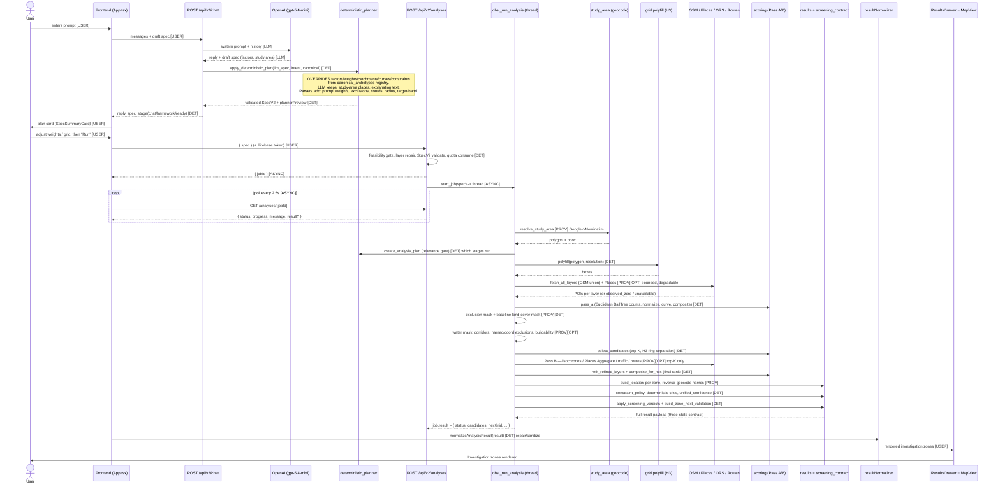
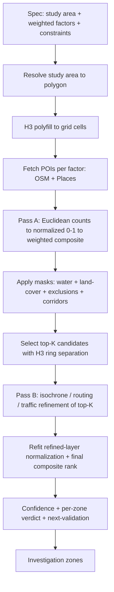

# 02 — End-to-End Execution Flow

Legend for stage type: **[LLM]** LLM-controlled · **[DET]** deterministic ·
**[PROV]** provider-dependent · **[USER]** user-editable · **[ASYNC]**
asynchronous/polled · **[OPT]** optional (planner-gated or degradable).

## Full flow

### Stage annotations

- **LLM-controlled:** the chat reply text, the *initial* factor/study-area
  extraction, and per-candidate explanation prose. Nothing the LLM emits
  reaches the final score after the deterministic override.
- **Deterministic:** planning override, validation, grid, scoring,
  normalization, curves, masks (logic), candidate selection, confidence,
  verdicts, next-validation. **This is where ranking is decided.**
- **Provider-dependent:** geocode, OSM/Places fetch, isochrones, Google
  Routes, reverse geocode. All bounded + degradable.
- **User-editable:** the prompt, weight sliders, grid-level picker, the "Run"
  confirmation, post-run reweighting.
- **Asynchronous:** job creation returns a `jobId` immediately; the frontend
  polls every 2.5 s until a terminal status.
- **Optional / planner-gated:** water geometry, buildability sub-checks,
  routing, isochrone refinement, Places Aggregate, traffic, place details —
  each runs only when relevant and degrades to a labeled fallback on failure.

## Essential spatial-analysis core (simplified)

Strip the LLM chat, deterministic override, auth, PDF, sessions, and evidence
trail, and the irreducible engine is:

Everything else in the current portal wraps this core. A new LLM-led portal
needs **this core plus an LLM planner that emits the input spec** — and does
not need the hardcoded archetype registry that currently sits between the LLM
and this core.
